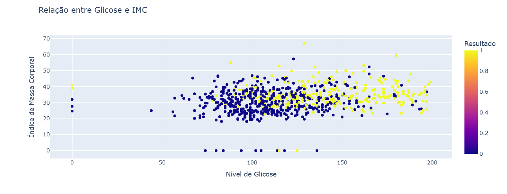
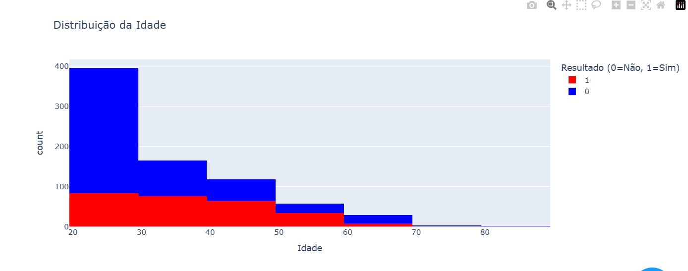
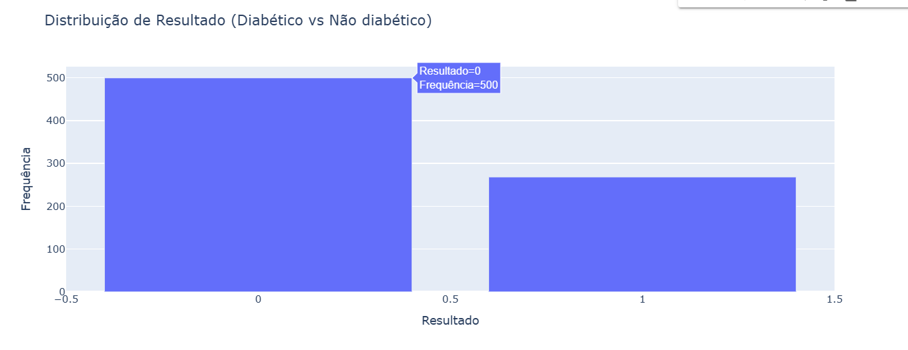

# Tema do Projeto

O projeto visa desenvolver um modelo preditivo para identificar a presença de diabetes com base em medições clínicas. O conjunto de dados utilizado foi coletado pelo National Institute of Diabetes and Digestive and Kidney Diseases e contém informações de diversas variáveis relacionadas à saúde. O objetivo é realizar um dashbord que apresenta como alguns fatores podem estar relacionados a diabetes.

# Link no Github do Projeto

O código e os arquivos associados a este projeto estão disponíveis no seguinte repositório do GitHub:  
[Link para o repositório no GitHub](https://github.com/AnaMaria27/DataScienceProjetoFinal)

# Dataset Utilizado

## Origem

O dataset utilizado neste projeto foi obtido de Kaggle. O conjunto de dados contém informações sobre diabetes, os dados foram estraidos do  National Institute of Diabetes and Digestive and Kidney Diseases. O objetivo é prever com base em medições de diagnóstico se um paciente tem diabetes. Ele contém 768 instâncias e 10 variaveis, pode ser visto  [aqui](https://www.kaggle.com/datasets/mathchi/diabetes-data-set).

## Variáveis

As  variáveis no dataset são:
- **ID**: Identificador do dado 
- **Gravidez:** Número de vezes que engravidou
- **Glicose:** Concentração plasmática de glicose em 2 horas em um teste oral de tolerância à glicose
- **Pressão arterial:** Pressão arterial diastólica (mm Hg)
- **Espessura da pele:** Espessura da prega cutânea do tríceps (mm)
- **Insulina:** insulina sérica de 2 horas (mu U/ml)
- **IMC:** Índice de massa corporal (peso em kg/(altura em m)^2)
- **DiabetesPedigreeFunction:** Tendência ao desenvolvimento de diabetes com base nas relações genéticas do indivíduo
- **Idade:** Idade (anos)
- **Resultado:** Variável de classe (0 para não possui ou 1 para possui )
## Transformações Realizadas

Durante o pré-processamento, várias transformações foram realizadas no dataset original para garantir a qualidade dos dados e facilitar a modelagem. Algumas das transformações incluem:

- **Realizado a adição do campo verificardor**: Foi adicionado um campo ID para identificar os conjuntos de informaçãoes, foi colocado iniciando em 0. 
- **Dados Faltantes**: O dataset estava com nenhum dado faltante, as informações sem dados estavam com 0.
- **Dados Duplicados**: Foi realizado uma análise para verificar infomações duplicadas em mais de um id, porém não foram encontradas nenhuma informação duplicada ou com inconsistencia. 

# Resultados Obtidos

Os resultados obtidos durante o desenvolvimento do dshbord foram os seguinte:

**Relação entre Glicose e IMC**

O gráfico de dispersão revelou uma correlação significativa entre os níveis de glicose e a presença de diabetes. Indivíduos diabéticos (Resultado = 1) tendem a apresentar níveis mais elevados de glicose em comparação com não diabéticos. No entanto, o índice de massa corporal (IMC) não mostrou uma relação direta com o resultado do diagnóstico, indicando que o IMC isoladamente não é um fator preditivo confiável para a presença de diabetes.

**Distribuição de Idade**

A análise da distribuição etária indicou que a maioria dos casos de diabetes ocorre em indivíduos com mais de 40 anos, sugerindo uma maior prevalência da condição em faixas etárias mais altas. Indivíduos mais jovens, especialmente aqueles abaixo de 30 anos, apresentam uma menor probabilidade de diagnóstico de diabetes.

**Distribuição de Resultados (Diabético vs Não Diabético)**

O gráfico de barras mostrou que a maioria dos indivíduos no conjunto de dados é classificada como não diabética (Resultado = 0), enquanto uma parcela menor apresenta diagnóstico de diabetes (Resultado = 1). Essa diferença pode refletir uma menor prevalência da condição na população analisada ou características demográficas específicas do conjunto de dados.

**Estatísticas Descritivas**

A análise estatística detalhou os seguintes aspectos:

**Glicose:** A média dos níveis de glicose é significativamente maior em indivíduos diabéticos, reforçando a importância deste indicador no diagnóstico da condição.

**IMC:** Embora a média do IMC seja ligeiramente maior em indivíduos diabéticos, há uma grande variação dentro de ambos os grupos, conforme indicado pelo desvio padrão.

**Idade:** Indivíduos diabéticos apresentam uma média de idade mais alta, confirmando a relação entre envelhecimento e maior risco de diabetes.

